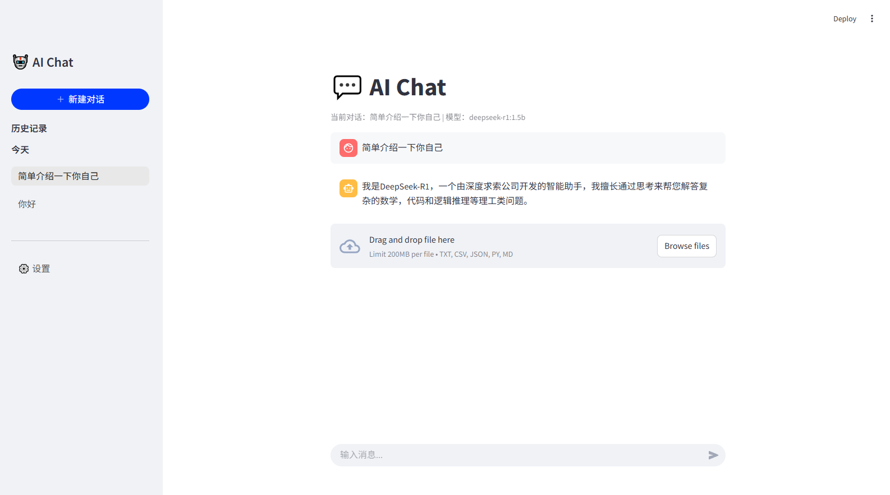

# AI Chat 💬

[](https://www.python.org/) [](https://streamlit.io/)[](LICENSE)

一个基于 Streamlit 的 AI 聊天应用，支持 OpenAI 和本地 Ollama 模型，提供多对话管理和文件上传功能。



## ✨ 功能特性

- 🤖 **多模型支持** - 支持 OpenAI GPT 系列和本地 Ollama 模型
- 💬 **多对话管理** - 创建、切换、管理多个独立对话
- 📎 **文件上传** - 支持上传文本文件作为对话上下文
- 🔄 **实时交互** - 即时显示用户消息和 AI 回复
- 📦 **本地模型管理** - 自动检测和管理 Ollama 本地模型
- 🎨 **现代化 UI** - 清晰的侧边栏和聊天界面设计

## 🚀 快速开始

### 前置要求

- Python 3.8 或更高版本
- (可选) [Ollama](https://ollama.ai/) - 用于运行本地模型

### 安装

1. 克隆仓库

```bash
git clone https://github.com/your-username/ai-chat.git
cd ai-chat
```

1. 安装依赖

```bash
pip install -r requirements.txt
```

1. 运行应用

```bash
streamlit run app.py
```

1. 在浏览器中打开 `http://localhost:8501`

## 📖 使用指南

### OpenAI 模型

1. 在侧边栏输入你的 OpenAI API Key
2. 从下拉菜单选择模型 (GPT-3.5 Turbo / GPT-4)
3. 开始对话

### 本地 Ollama 模型

1. 安装并启动 Ollama

```bash
ollama serve
```

1. 拉取模型

```bash
ollama pull llama2
# 或其他模型
ollama pull qwen2:7b
```

1. 在应用中选择 Ollama 模型即可使用

### 文件上传

1. 点击输入框左侧的 📎 图标
2. 选择支持的文本文件 (.txt, .csv, .json, .py, .md)
3. 输入你的问题，AI 会参考文件内容回答

## 📁 项目结构

```txt
ai-chat/
├── app.py                  # 应用入口
├── config.py               # 配置文件
├── data_models.py          # 数据模型定义
├── models/                 # AI 模型模块
│   ├── base.py             # 模型基类
│   ├── model_manager.py    # 模型管理器
│   ├── openai_model.py     # OpenAI 模型实现
│   └── ollama_model.py     # Ollama 模型实现
├── services/               # 服务层
│   ├── ai_service.py       # AI 服务
│   └── file_service.py     # 文件服务
├── ui/                     # UI 组件
│   ├── chat.py             # 聊天界面
│   ├── sidebar.py          # 侧边栏
│   └── styles.py           # 样式定义
├── utils/                  # 工具函数
│   ├── helpers.py          # 辅助函数
│   └── session.py          # 会话管理
├── requirements.txt        # 依赖列表
└── README.md               # 项目说明
```

## 🔧 配置说明

在 `config.py` 中可以修改以下配置：

| 配置项             | 说明             | 默认值                      |
| :----------------- | :--------------- | :-------------------------- |
| `PAGE_CONFIG`      | 页面配置         | 标题、图标、布局            |
| `OLLAMA_BASE_URL`  | Ollama 服务地址  | `http://localhost:11434/v1` |
| `UPLOAD_CONFIG`    | 文件上传配置     | 支持的文件类型              |
| `TITLE_MAX_LENGTH` | 对话标题最大长度 | 30                          |

## 🛠️ 扩展开发

### 添加新的模型

1. 在 `models/` 目录下创建新的模型类
2. 继承 `BaseModel` 基类
3. 实现 `chat()` 和 `is_available()` 方法
4. 在 `model_manager.py` 中注册新模型

### 自定义样式

编辑 `ui/styles.py` 中的 CSS 样式来自定义界面外观。

## 📝 依赖

- [Streamlit](https://streamlit.io/) - Web 应用框架
- [OpenAI](https://github.com/openai/openai-python) - OpenAI API 客户端
- [httpx](https://github.com/encode/httpx) - HTTP 客户端

## 🤝 贡献

欢迎提交 Issue 和 Pull Request！

1. Fork 本仓库
2. 创建你的特性分支 (`git checkout -b feature/AmazingFeature`)
3. 提交你的改动 (`git commit -m 'Add some AmazingFeature'`)
4. 推送到分支 (`git push origin feature/AmazingFeature`)
5. 打开一个 Pull Request

## 📄 许可证

本项目基于 MIT 许可证开源 - 详见 [LICENSE](LICENSE) 文件

## 🙏 致谢

- [Streamlit](https://streamlit.io/) - 优秀的 Python Web 框架
- [OpenAI](https://openai.com/) - 强大的 AI API
- [Ollama](https://ollama.ai/) - 本地大模型运行工具

---

<p align="center">Made with ❤️ by STYLAN</p>
